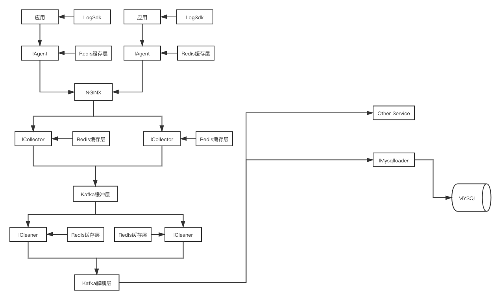
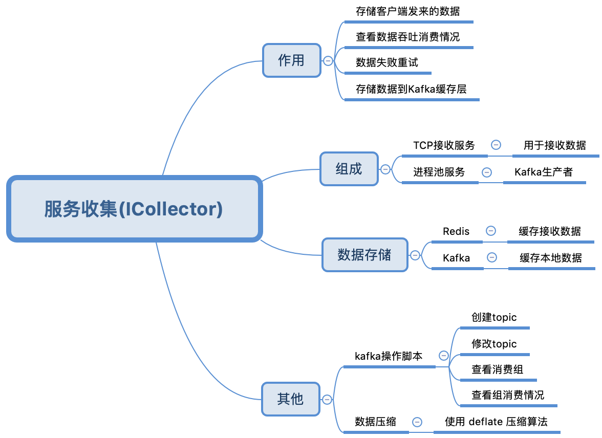

#### 日志服务架构图
- 基础架构
  - 
- 可拓展架构
  - 

#### 服务代理(IAgent)

#### 依赖环境
- PHP 7.x
- Swoole 4.x
- Swoft 2.x

#### 启动方式
- TCP Server
  - php bin/swoft tcp:start
- 进程池 Server
  - php bin/swoft process:start
  
#### 不足之处
- 错误机制未完善
- 后续需要通过 Supervisord 对服务进行统一管理
- 系统监控还没有